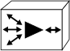
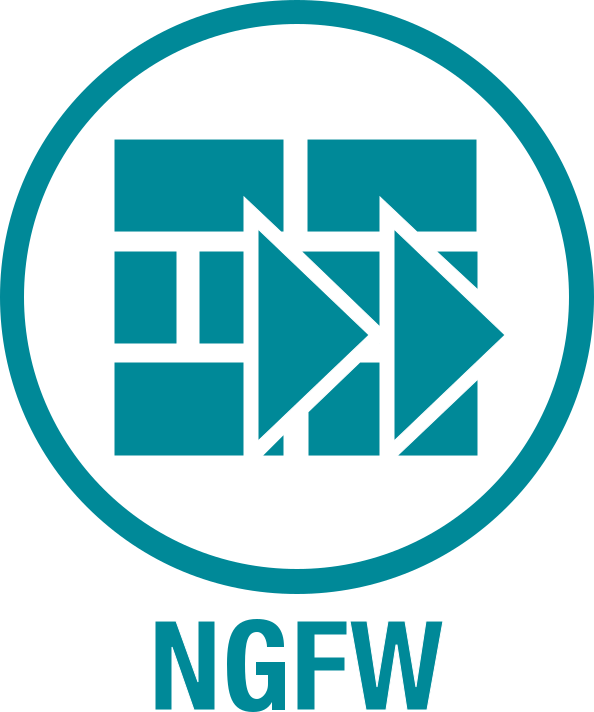
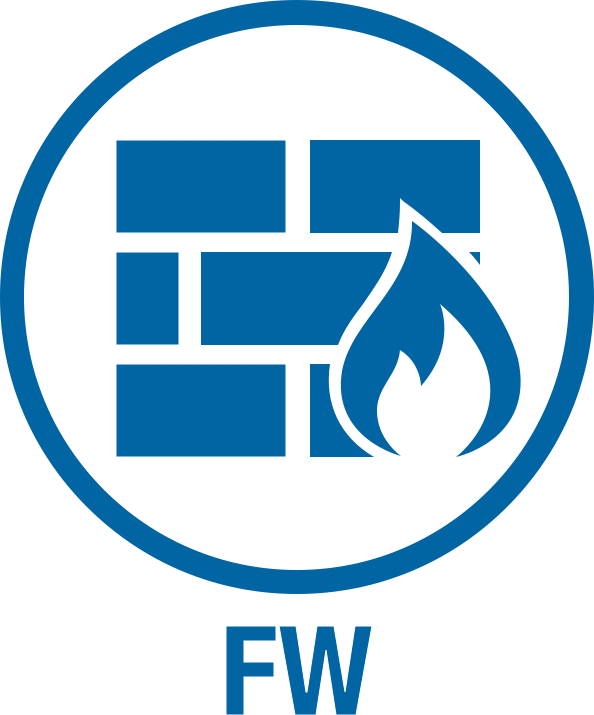
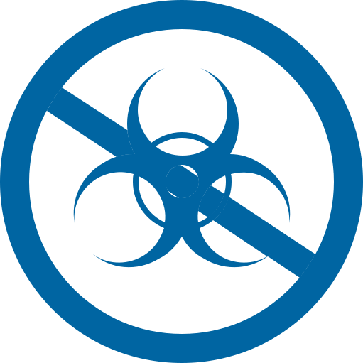
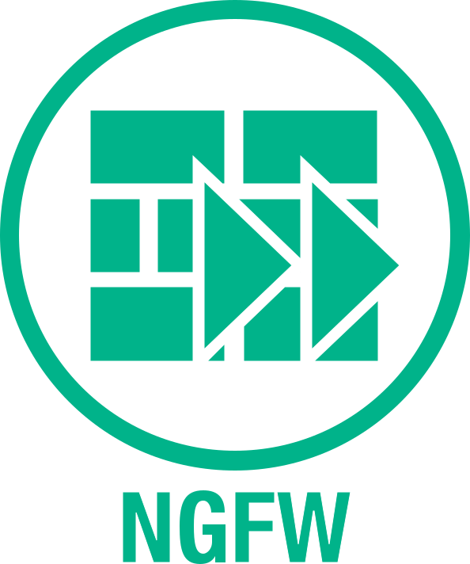
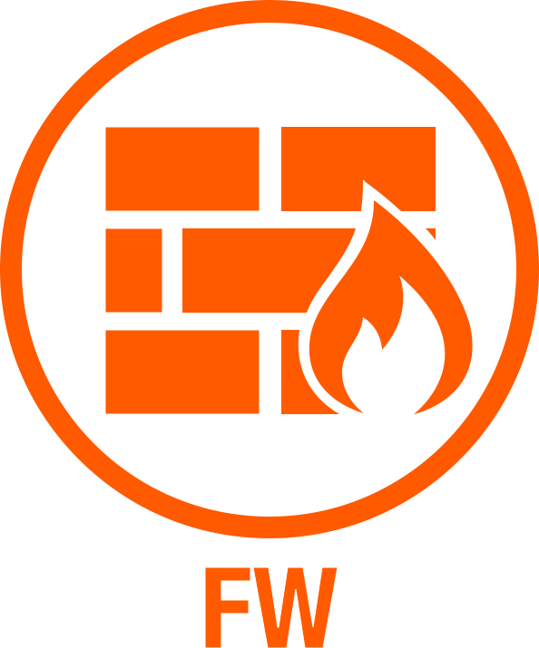
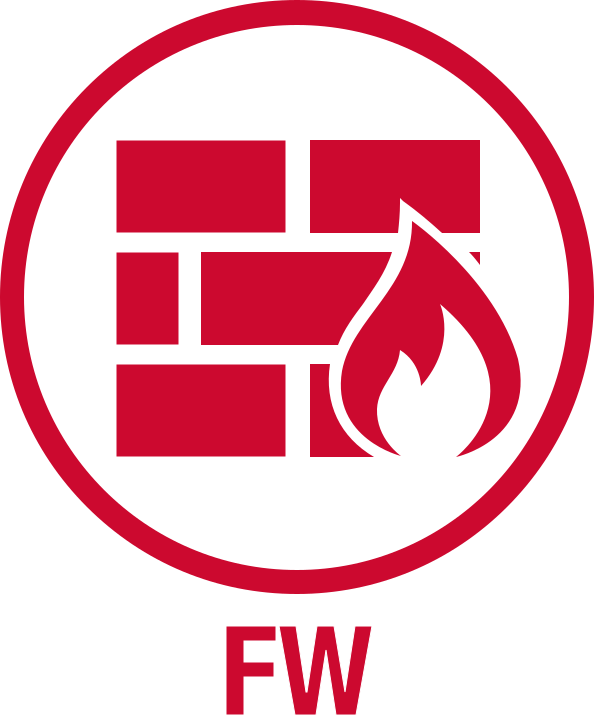
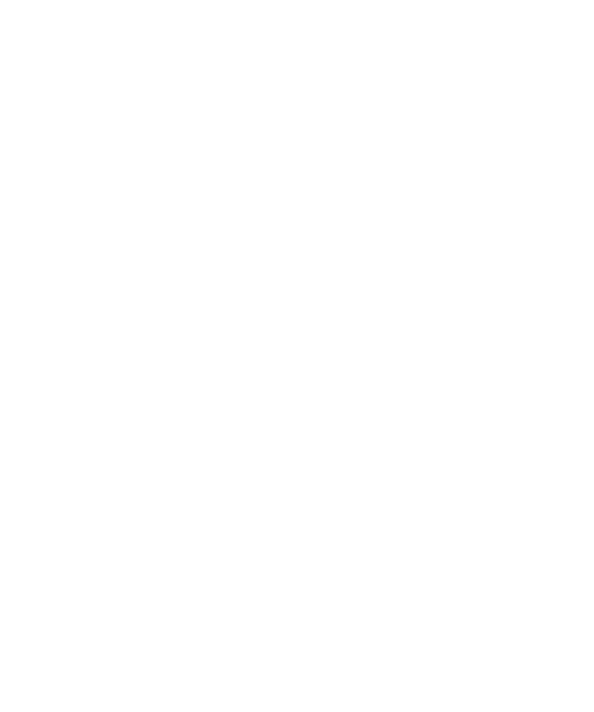
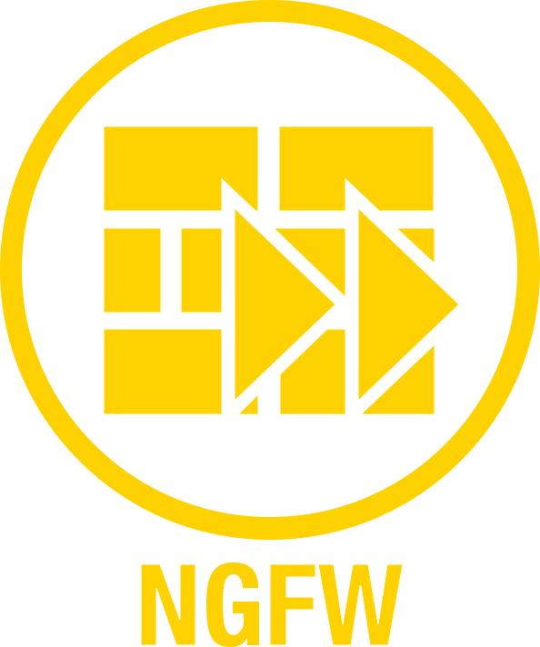

# yEd_network_palettes

yEd graphml palettes for network diagrams - My stencils to replace Visio with yEd

## What this repo contains

These are the yEd palette's (a.k.a. stencils) that I use for creating network diagrams.

It also contains all of the icon sets in SVG format that those palette's are made from.

My goal was to be able to replace Visio with yEd as my primary network diagram tool.
These are the network and security icons that I required to reach my goal.

# Installation

You do not need to download this entire repository in order to install these palette's in yEd.

You only need to download the palette or icons that you wish to use.

Each palette is a single file (ending in .graphml) which contains a group of icons from an icon set.

Each icon set is a directory containing a number of icon graphics in SVG format.

## To Install A Palette

Choose which palette you wish to install and download that particular .graphml file.

To install the downloaded palette into yEd follow these simple steps:
* Click on ```Edit```
* In the Edit drop down click on ```Manage Palette...```
* In the Palette Manager click on ```Import Section```
* Browse to the palette you downloaded and click ```Open```
* You should now see it listed in both the Available and Displayed Palette Sections lists
* Close the Palette Manager
* Enjoy

## To Install An Icon

Choose which icon you wish to install and download that particular .svg file.

To install the downloaded icon into yEd follow these simple steps:
* Click on ```Edit```
* In the Edit drop down click on ```Manage Palette...```
* In the Palette Manager select a section to import your icon into or click on ```New Section``` to create a new one
* In the Palette Manager click on ```Import Symbols```
* Browse to the icon you downloaded and click ```Open```
* Close the Palette Manager
* You should now see your icon in the palette section you chose to import it into
* Enjoy

## Download Links

Here are links to the palettes and icon sets available with a few examples of each.

#### Cisco Network Topology Icons

Palette | Icon Set | Examples
----- | ----- | -----
[Network_Topology-Aqua.graphml](https://raw.githubusercontent.com/gowenrw/yEd_network_palettes/master/yEd_palettes/Network_Topology-Aqua.graphml) | [My_3015_Aqua](icon_sets/My_3015_Aqua) |      
[Network_Topology-Black.graphml](https://raw.githubusercontent.com/gowenrw/yEd_network_palettes/master/yEd_palettes/Network_Topology-Black.graphml) | [My_3015_Black](icon_sets/My_3015_Black) |      
[Network_Topology-Blue.graphml](https://raw.githubusercontent.com/gowenrw/yEd_network_palettes/master/yEd_palettes/Network_Topology-Blue.graphml) | [My_3015_Blue](icon_sets/My_3015_Blue) |      
[Network_Topology-Brown.graphml](https://raw.githubusercontent.com/gowenrw/yEd_network_palettes/master/yEd_palettes/Network_Topology-Brown.graphml) | [My_3015_Brown](icon_sets/My_3015_Brown) |      
[Network_Topology-Cyan.graphml](https://raw.githubusercontent.com/gowenrw/yEd_network_palettes/master/yEd_palettes/Network_Topology-Cyan.graphml) | [My_3015_Cyan](icon_sets/My_3015_Cyan) |      
[Network_Topology-Green.graphml](https://raw.githubusercontent.com/gowenrw/yEd_network_palettes/master/yEd_palettes/Network_Topology-Green.graphml) | [My_3015_Green](icon_sets/My_3015_Green) |      
[Network_Topology-Grey.graphml](https://raw.githubusercontent.com/gowenrw/yEd_network_palettes/master/yEd_palettes/Network_Topology-Grey.graphml) | [My_3015_Grey](icon_sets/My_3015_Grey) |      
[Network_Topology-Orange1.graphml](https://raw.githubusercontent.com/gowenrw/yEd_network_palettes/master/yEd_palettes/Network_Topology-Orange1.graphml) | [My_3015_Orange1](icon_sets/My_3015_Orange1) |      
[Network_Topology-Orange2.graphml](https://raw.githubusercontent.com/gowenrw/yEd_network_palettes/master/yEd_palettes/Network_Topology-Orange2.graphml) | [My_3015_Orange2](icon_sets/My_3015_Orange2) |      
[Network_Topology-Red.graphml](https://raw.githubusercontent.com/gowenrw/yEd_network_palettes/master/yEd_palettes/Network_Topology-Red.graphml) | [My_3015_Red](icon_sets/My_3015_Red) |      
[Network_Topology-White.graphml](https://raw.githubusercontent.com/gowenrw/yEd_network_palettes/master/yEd_palettes/Network_Topology-White.graphml) | [My_3015_White](icon_sets/My_3015_White) |      
[Network_Topology-Yellow.graphml](https://raw.githubusercontent.com/gowenrw/yEd_network_palettes/master/yEd_palettes/Network_Topology-Yellow.graphml) | [My_3015_Yellow](icon_sets/My_3015_Yellow) |      

#### Fortinet Network Security Icons

Palette | Icon Set | Examples
----- | ----- | -----
[Network_Security-Aqua.graphml](https://raw.githubusercontent.com/gowenrw/yEd_network_palettes/master/yEd_palettes/Network_Security-Aqua.graphml) | [My_FTNT_Aqua](icon_sets/My_FTNT_Aqua) |      
[Network_Security-Black.graphml](https://raw.githubusercontent.com/gowenrw/yEd_network_palettes/master/yEd_palettes/Network_Security-Black.graphml) | [My_FTNT_Black](icon_sets/My_FTNT_Black) |      
[Network_Security-Blue.graphml](https://raw.githubusercontent.com/gowenrw/yEd_network_palettes/master/yEd_palettes/Network_Security-Blue.graphml) | [My_FTNT_Blue](icon_sets/My_FTNT_Blue) |      
[Network_Security-Brown.graphml](https://raw.githubusercontent.com/gowenrw/yEd_network_palettes/master/yEd_palettes/Network_Security-Brown.graphml) | [My_FTNT_Brown](icon_sets/My_FTNT_Brown) |      
[Network_Security-Cyan.graphml](https://raw.githubusercontent.com/gowenrw/yEd_network_palettes/master/yEd_palettes/Network_Security-Cyan.graphml) | [My_FTNT_Cyan](icon_sets/My_FTNT_Cyan) |      
[Network_Security-Green.graphml](https://raw.githubusercontent.com/gowenrw/yEd_network_palettes/master/yEd_palettes/Network_Security-Green.graphml) | [My_FTNT_Green](icon_sets/My_FTNT_Green) |      
[Network_Security-Grey.graphml](https://raw.githubusercontent.com/gowenrw/yEd_network_palettes/master/yEd_palettes/Network_Security-Grey.graphml) | [My_FTNT_Grey](icon_sets/My_FTNT_Grey) |      
[Network_Security-Orange1.graphml](https://raw.githubusercontent.com/gowenrw/yEd_network_palettes/master/yEd_palettes/Network_Security-Orange1.graphml) | [My_FTNT_Orange1](icon_sets/My_FTNT_Orange1) |      
[Network_Security-Orange2.graphml](https://raw.githubusercontent.com/gowenrw/yEd_network_palettes/master/yEd_palettes/Network_Security-Orange2.graphml) | [My_FTNT_Orange2](icon_sets/My_FTNT_Orange2) |      
[Network_Security-Red.graphml](https://raw.githubusercontent.com/gowenrw/yEd_network_palettes/master/yEd_palettes/Network_Security-Red.graphml) | [My_FTNT_Red](icon_sets/My_FTNT_Red) |      
[Network_Security-White.graphml](https://raw.githubusercontent.com/gowenrw/yEd_network_palettes/master/yEd_palettes/Network_Security-White.graphml) | [My_FTNT_White](icon_sets/My_FTNT_White) |      
[Network_Security-Yellow.graphml](https://raw.githubusercontent.com/gowenrw/yEd_network_palettes/master/yEd_palettes/Network_Security-Yellow.graphml) | [My_FTNT_Yellow](icon_sets/My_FTNT_Yellow) |      

___

___

# More detail

Here are some more details about this project, why I started it, and how I got it to where it is today.

## What is yEd

yEd graph editor is a powerful and  free to use graph and diagram tool.

Unlike my current primary diagraming tool Visio, I can run yEd on my Linux boxes and my Windows boxes allowing me to work on my documents wherever I happen to be.

This was the primary motivation for me to create these icons sets.  I needed these icons in my diagrams and I want to work on those diagrams from any of my platforms.

You can find more information and download the tool here: https://www.yworks.com/products/yed

## What network symbols are already available for yEd

yEd does not contain many network diagram symbols in its default palette (I think there are 12 total)

There are some other palette sets created by others that I have used.
But they alone were insufficient for my needs.

Here are some links to these graphml pallette sets.

* https://github.com/pafnow/vrt-graphml-for-yed
* https://github.com/JustDerb/yed-aws-palettes

## How do you create a palette set for yEd

yEd has a built in palette manager that allows you to create new palettes and import symbols in SVG format.

Using this I was able to create the palettes I needed for network diagrams that you will find here.

## Where do the SVG icons in my palettes come from

### Cisco Network Topology Icons

* I have used the official Cisco.com site here https://www.cisco.com/c/en/us/about/brand-center/network-topology-icons.html
  * This requires conversion of EPS to SVG
  * I used Inkscape for this
    * These are the instructions I found on web that didn't work for me (maybe works on a different OS?)
      * For one file ```inkscape input-file.eps --export-plain-svg=output-file.svg```
      * For multiple files ```for %%f in (*.eps) do inkscape "%%f" --export-plain-svg="%%f.svg"```
    * These are the commands I used on my Ubuntu 18 rig
      * For one file ```/usr/bin/inkscape input-file.eps --export-plain-svg=output-file.svg```
      * For multiple files ```for i in $( ls *.eps ); do /usr/bin/inkscape $i --export-plain-svg=$i.svg; done```
  * UPDATE: The Inkscape process above caused some issues with image scaling in yEd
    * I have redone the Cisco icon conversions using Adobe Illustrator
      * While this could not be done on the command line I was able to create an action group to run in batch mode
      * The Adobe Illustrator automation actions can be defined under Windows->Actions
      * More info on this process can be found here https://helpx.adobe.com/illustrator/using/automation-actions.html

### Fortinet Network Security Icons

* I have used some icons from the official Fortinet site here https://www.fortinet.com/resources/icon-library.html
  * This set is provided as a powerpoint document which I extracted the icons from simply by renaming it .zip and opening the media folder
  * The icons I chose to use from this set were in emf format (enhanced windows metafile)
  * Using this awesome emf2svg tool I was able to convert them https://github.com/kakwa/libemf2svg
    * This is the command I used to convert these files using this tool
      * ```for f in *.emf; do emf2svg-conv -i $f -o ${f%.emf}.svg -v; done```

### Other References

* I also referenced the SVG icons from this project https://sourceforge.net/projects/nedi2graphml/
  * I liked the color set they did and looked at what color codes they used for creating my own icon sets

## How to standardize the icon colors and create color sets

To change the colors I used sed on the svg files which are just text files that can be manipulated.

To get a single color from the base images this required quite a few sed passes as the vendors used many color variations.

I started with converting to the color Orange1 which is a light orange so I could tell where I missed any of the original color.

* ```for i in $( ls *.svg ); do sed -i "s/036998/FFAA00/" $i; done```
* ```for i in $( ls *.svg ); do sed -i "s/036897/FFAA00/" $i; done```
* ```for i in $( ls *.svg ); do sed -i "s/02709F/FFAA00/" $i; done```
* ```for i in $( ls *.svg ); do sed -i "s/007EBA/FFAA00/" $i; done```
* ...Many More

To make each color after that was a single sed pass.

* Aqua ```for i in $( ls *.svg ); do sed -i "s/FFAA00/008998/" $i; done```
* Black ```for i in $( ls *.svg ); do sed -i "s/FFAA00/000000/" $i; done```
* Blue ```for i in $( ls *.svg ); do sed -i "s/FFAA00/0065A2/" $i; done```
* Brown ```for i in $( ls *.svg ); do sed -i "s/FFAA00/7B2927/" $i; done```
* Cyan ```for i in $( ls *.svg ); do sed -i "s/FFAA00/00B38A/" $i; done```
* Green ```for i in $( ls *.svg ); do sed -i "s/FFAA00/B5BF00/" $i; done```
* Grey ```for i in $( ls *.svg ); do sed -i "s/FFAA00/707070/" $i; done```
* Orange2 ```for i in $( ls *.svg ); do sed -i "s/FFAA00/FF5A00/" $i; done```
* Red ```for i in $( ls *.svg ); do sed -i "s/FFAA00/CC092F/" $i; done```
* Yellow ```for i in $( ls *.svg ); do sed -i "s/FFAA00/FED100/" $i; done```

For White I first took any white and changed it to Black, then I converted to White

* ```for i in $( ls *.svg ); do sed -i "s/[fF][fF][fF][fF][fF][fF]/000000/" $i; done```
* ```for i in $( ls *.svg ); do sed -i "s/FFAA00/FFFFFF/" $i; done```

# Legal

I have used publicly available but NOT public domain icons here (only modifying colors or file names as needed).
These icons are the property of the respective companies who created them (linked above) and their copyrights and EULAs still apply.
